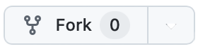
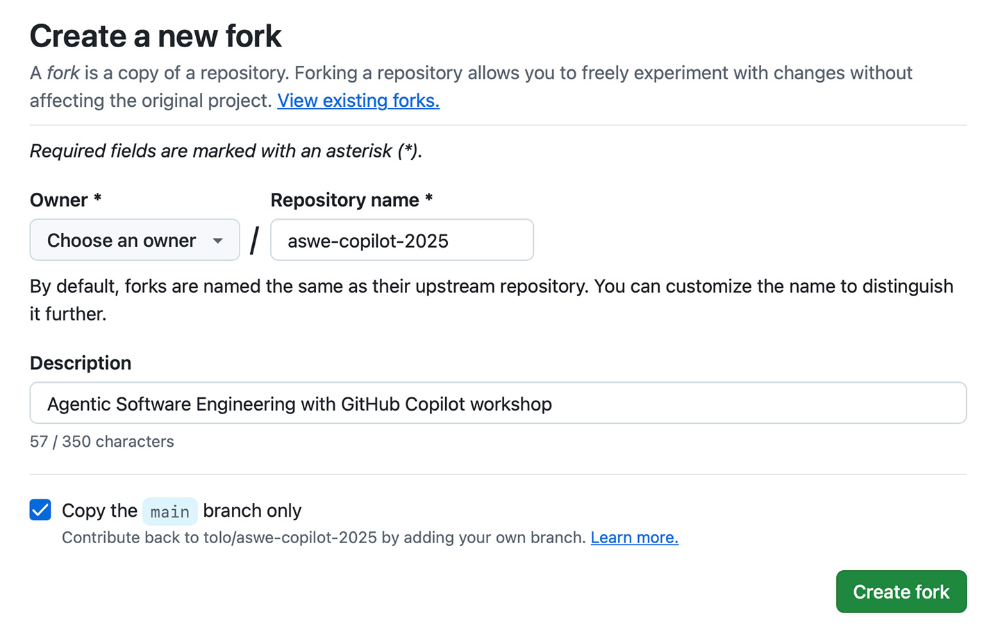
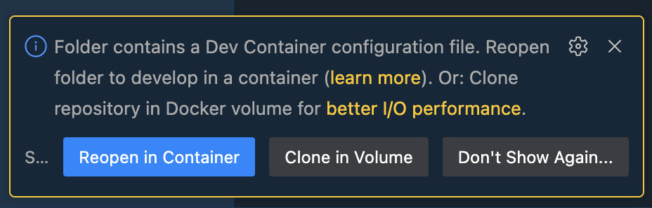
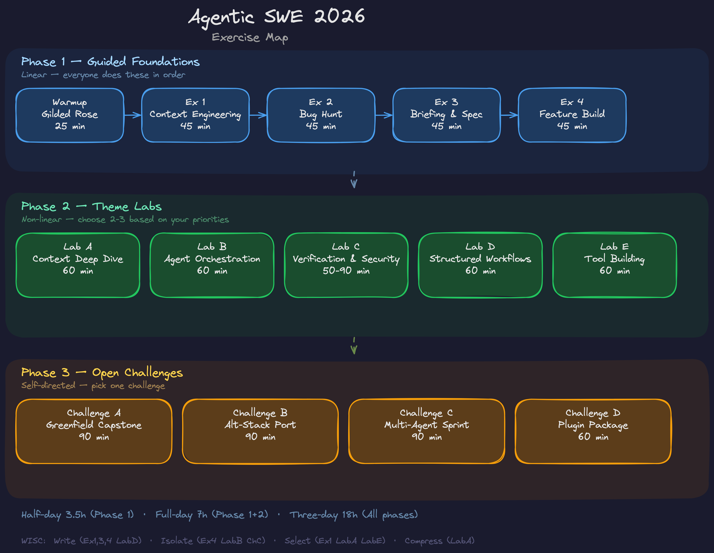
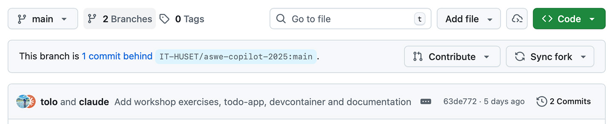

# Agentic Software Engineering with Claude Code

A hands-on workshop for learning AI-assisted software development using [Claude Code](https://code.claude.com).

## Who Is This For?

Software engineers who want to master agentic development patterns — from basic AI-assisted coding to orchestrating multi-agent workflows. No prior Claude Code experience required.

## Prerequisites

- A Claude account with Claude Code access ([sign up](https://claude.ai))
- **GitHub account** (free account works)
- One of:
  - **GitHub Codespaces** (recommended, zero local setup)
  - **Docker Desktop** + VS Code with Dev Containers extension
  - **Local setup**: Python 3.11+, Node.js 18+, [uv](https://docs.astral.sh/uv/)

## Getting Started

Follow the steps below to prepare your development environment for the exercises. You have three options: **GitHub Codespaces** (recommended), **Dev Container** (local Docker), or **local setup** (no containers).

- _Benefit of **GitHub Codespaces**_: No local setup required, works on any machine, quickest to get started
- _Benefit of **Dev Container**_: Works offline, more control over environment
- _Benefit of **local setup**_: Full control, no Docker overhead

### Step 1: Fork the Repository

You need your own fork to push changes. _**See also:**_ [Keeping your fork in sync](#keeping-your-fork-in-sync) if the original repository is updated later.

1. Click the **Fork** button at the top-right of this page<br/>
   

2. Select your **_personal_** GitHub account as the owner of the fork<br/>
   <br/>
   _**Note:** Do NOT fork to an organization account, as this may cause issues with GitHub Codespaces access._

<details>
<summary><strong>Need help setting up access to GitHub?</strong> (click to expand)</summary>

<br/>

If you're using **GitHub Codespaces** (Option A), you don't need any local git setup — skip ahead to Step 2.

For **Options B and C** you need to be able to clone your fork. The easiest way is **HTTPS + GitHub CLI**:

**GitHub CLI (recommended)**

Install the GitHub CLI and authenticate — it handles credentials automatically:

```bash
# macOS
brew install gh

# Windows
winget install --id GitHub.cli

# Ubuntu / Debian
sudo apt update && sudo apt install gh
```

```bash
gh auth login
# Follow the prompts: select GitHub.com, HTTPS, and authenticate via browser
```

Then clone with:
```bash
gh repo clone YOUR_USERNAME/agentic-swe-2026
```

**SSH keys (alternative)**

If you prefer SSH:

```bash
# Generate a key
ssh-keygen -t ed25519 -C "your_email@example.com"

# Copy the public key
cat ~/.ssh/id_ed25519.pub
# (copy the output)
```

Add the key at **GitHub → Settings → SSH and GPG keys → New SSH key**, then clone with:
```bash
git clone git@github.com:YOUR_USERNAME/agentic-swe-2026.git
```

See [GitHub's SSH guide](https://docs.github.com/en/authentication/connecting-to-github-with-ssh) for more details.

</details>

### Step 2: Launch the Development Environment

Choose **one** of the three options below.

#### Option A: GitHub Codespaces (Recommended)

1. On your fork's GitHub page, click **Code** → **Codespaces** → **Create codespace on main**
2. Wait for the codespace to build (~3-5 minutes first time)
3. Once loaded, open the terminal

#### Option B: Dev Container (Local Docker)

1. Clone your fork locally
2. Ensure **Docker Desktop** (or your preferred Docker environment) is running
3. Open the project in VS Code
4. When prompted, click **Reopen in Container**<br/>
   <br/>
   If not prompted, open the Command Palette (`Cmd+Shift+P` / `Ctrl+Shift+P`), type `Dev Containers: Reopen in Container`, and select it
5. Wait for the container to build — _this may take several minutes on first run_

#### Option C: Local Setup (No Docker)

1. Clone your fork locally
2. Install prerequisites:
   ```bash
   # Python (3.11+)
   python3 --version

   # uv package manager
   curl -LsSf https://astral.sh/uv/install.sh | sh

   # Node.js (18+, needed for MCP servers)
   node --version

   # Claude Code
   npm install -g @anthropic-ai/claude-code
   ```
3. Set up the todo app:
   ```bash
   cd todo-app
   uv sync
   ```

### Step 3: Start Claude Code

Open the terminal and run:

```bash
claude
```

On first launch, Claude Code will ask you to authenticate. Select the option to sign in with your Claude subscription and follow the browser-based authentication flow. 

_Note: When using GitHub Codespaces or dev containers, the authentication flow might not work correctly the first time due to the isolated environment. If you retry, you should get a code that you can directly paste into the terminal._ 


**Optional — install the VS Code extension:**

```bash
code --install-extension anthropic.claude-code
```

### Step 4: Verify Setup

```bash
# Check Claude Code
claude --version

# Start the todo app
cd todo-app
uv run uvicorn app.main:app --reload
# Open http://localhost:8000
# Login: demo@example.com / demo123
```

---

## Workshop Structure



**[Interactive Course Navigator](docs/course-navigator.html)** — Click any exercise to see descriptions, concepts, WISC strategies, and concept threads. Filter by phase, concept thread, or WISC strategy.

The workshop has three phases. **Phase 1** is linear and designed as a standalone half-day. **Phase 2** is non-linear — students choose 2-3 Theme Labs based on what matters most to them. **Phase 3** is open-ended — one challenge, student's choice of approach.

<details>
<summary><strong>Project Structure (click to expand)</strong></summary>

```bash
├── docs/                           # Exercises, reference cards, guidelines
│   ├── exercises/                  # Workshop exercises
│   │   ├── warmup/                 # Gilded Rose kata
│   │   ├── part-1-fundamentals/    # Exercises 1-4 (Phase 1: Guided Foundations)
│   │   ├── part-2-intermediate/    # Labs A-E (Phase 2: Theme Labs)
│   │   ├── part-3-advanced/        # Challenges A-D (Phase 3: Open Challenges)
│   │   └── templates/              # Lab and challenge format templates
│   ├── reference/                  # Quick-reference cards (WISC, PIV loop, failure patterns, etc.)
│   ├── rules/                      # Development guidelines
│   ├── todo-app-requirements/      # App specifications
│   └── misc/                       # Tips and references
│
├── gen-image/                      # Image generation CLI (exercise)
│
├── gilded-rose/                    # Refactoring kata (warmup)
│
└── todo-app/                       # Full-stack todo application
    ├── src/app/                    # FastAPI application
    │   ├── main.py                 # App entry point
    │   ├── database.py             # SQLAlchemy models
    │   ├── utils.py                # Shared utilities
    │   ├── core/deps.py            # Auth dependencies
    │   ├── routes/                 # API endpoints
    │   ├── templates/              # Jinja2 HTML templates
    │   └── static/                 # CSS, JS, images
    └── tests/                      # Test suite
```

</details>

### Phase 1: Guided Foundations (~3 hours)

Linear. Every participant does every exercise in order. Builds the shared vocabulary and habits for Phases 2 and 3.

| Exercise | Title | Time | Principle |
|----------|-------|------|-----------|
| [Warmup](docs/exercises/warmup/gilded-rose.md) | Gilded Rose Kata | 30 min | Human-AI collaboration — "First run the tests" |
| [1](docs/exercises/part-1-fundamentals/exercise-1.md) | Context Engineering Foundations | 50 min | Context is architecture, not configuration |
| [2](docs/exercises/part-1-fundamentals/exercise-2.md) | Bug Hunt & Trust Calibration | 50 min | Verify before accepting (29.6% plausible-but-wrong rate) |
| [3](docs/exercises/part-1-fundamentals/exercise-3.md) | Briefing & Specification | 50 min | Briefing quality determines output quality |
| [4](docs/exercises/part-1-fundamentals/exercise-4.md) | Building a Feature | 50 min | Plan → Implement → Verify (the PIV Loop) |

### Phase 2: Theme Labs (~3-4 hours)

Non-linear. After a 15-minute plenary intro for each theme, students choose 2-3 labs. Each lab is self-contained and anchored to a [WISC strategy](docs/reference/context-economics.md).

| Lab | Title | Time | WISC Strategy |
|-----|-------|------|---------------|
| [A](docs/exercises/part-2-intermediate/lab-a-context-deep-dive.md) | Context Deep Dive | 60 min | SELECT + WRITE |
| [B](docs/exercises/part-2-intermediate/lab-b-agent-orchestration.md) | Agent Orchestration | 60 min | ISOLATE |
| [C](docs/exercises/part-2-intermediate/lab-c-verification-security.md) | Verification & Security | 50 min | All strategies |
| [D](docs/exercises/part-2-intermediate/lab-d-structured-workflows.md) | Structured Workflows | 60 min | WRITE + SELECT |
| [E](docs/exercises/part-2-intermediate/lab-e-tool-building.md) | Tool Building | 60 min | SELECT |

### Phase 3: Open Challenges (~1.5-3 hours)

Open-ended. Students choose one challenge and apply everything they've learned without step-by-step guidance.

| Challenge | Title | Time | What It Tests |
|-----------|-------|------|---------------|
| [A](docs/exercises/part-3-advanced/challenge-a.md) | Greenfield Capstone | 90 min | Full stack: context setup, spec writing, workflow choice |
| [B](docs/exercises/part-3-advanced/challenge-b.md) | Alt-Stack Port | 90 min | Requirements portability, CLAUDE.md for new stack |
| [C](docs/exercises/part-3-advanced/challenge-c.md) | Multi-Agent Sprint | 90 min | Orchestration, cost estimation, task decomposition |
| [D](docs/exercises/part-3-advanced/challenge-d.md) | Plugin from Workshop Work | 60 min | Curation, packaging, partner testing |

### Recommended Paths

| Format | Phase 1 | Phase 2 | Phase 3 |
|--------|---------|---------|---------|
| **Half-day** (~3.5h) | Warmup + Ex 1-3 | 1 instructor-selected lab (abbreviated) | — |
| **Full-day** (~7h) | Warmup + Ex 1-4 | 2-3 labs (student choice) | 1 challenge |
| **Three-day** (~18h) | Warmup + Ex 1-4 | All 5 labs | 1-2 challenges + showcase |

### Reference Materials

Quick-reference cards available in [`docs/reference/`](docs/reference/) — consult during exercises:

- [Briefing Template](docs/reference/briefing-template.md) — Five-part task brief, Osmani six-section, three-tier boundaries
- [Context Economics](docs/reference/context-economics.md) — thresholds, instruction compliance research, multi-agent ROI
- [Delegation Decision Tree](docs/reference/delegation-decision-tree.md) — HITL/HOTL/HOOTL, Skills vs Sub-agents vs MCP
- [Failure Patterns](docs/reference/failure-patterns.md) — 10 named patterns + WISC diagnostic lens
- [PIV Loop](docs/reference/piv-loop.md) — Plan→Implement→Verify, Sandwich Principle
- [Trust Spectrum](docs/reference/trust-spectrum.md) — vibe coding → agentic engineering, METR data
- [Agentic Patterns](docs/reference/agentic-patterns.md) — Willison's 10 patterns quick reference
- [Spec-Driven Development](docs/reference/spec-driven-development.md) — SDD tools (AndThen, PRP, Spec Kit, BMAD), when overhead is worth it

## The Todo App

The exercises use a full-stack todo application as the learning vehicle:

- **Backend**: Python + FastAPI
- **Frontend**: HTMX + Shoelace Web Components
- **Database**: SQLite + SQLAlchemy
- **Templates**: Jinja2

The app supports multiple lists, priorities, due dates, search, drag-and-drop reordering, and dark mode.

## Optional: API Keys

Some exercises use external services. Create a `.env` file from the template:

```bash
cp .env.example .env
# Edit .env with your keys
```

## Resources

- [Claude Code Documentation](https://code.claude.com)
- [CLAUDE.md Best Practices](https://code.claude.com/docs/en/memory)
- [AndThen Plugin](https://github.com/IT-HUSET/andthen) — Structured workflows for Claude Code (clarify → spec → implement → review). Used in Exercises 3, 4 and Lab D.
- [MCP Servers](https://github.com/modelcontextprotocol/servers)
- [Agentic Coding Tips](docs/misc/AGENTIC-CODING-TIPS.md)

---

## Keeping Your Fork in Sync

If the original repository is updated after you fork, you can pull in those changes.

**Option 1: Via GitHub UI** (easiest)<br/>
On your fork's GitHub page, click **"Sync fork"** if your branch is behind:<br/>
<br/>
_(Then select "Update branch" if prompted.)_

**Option 2: Via command line**
```bash
# Check if upstream remote exists
git remote -v
```

If `upstream` is not listed, add it:
```bash
git remote add upstream https://github.com/IT-HUSET/agentic-swe-2026.git
```

Then fetch and merge:
```bash
git fetch upstream
git checkout main
git merge upstream/main

# Optional: push to your fork's remote
git push origin main
```
