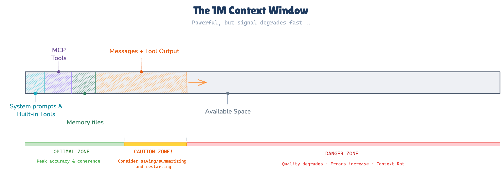

# Exercise 1: Context Engineering Foundations

> **Principle**: Context is architecture, not configuration

**Goal:** Discover why context matters by experiencing it, then learn to engineer it deliberately

**Time:** ~50 minutes

**Prerequisites:** Warmup completed

> **Recommended model:** `sonnet` at medium effort (`/model sonnet`)

---

## Task 1: The Mental Model (~5 min)

Before touching any files, establish the mental model that everything else in this exercise builds on.

**The RAM analogy**: The LLM is the CPU; its context window is RAM — the working memory for every conversation. Everything Claude knows about your project in a given session must fit in that window. What isn't in the window doesn't exist for Claude.

**[Willison](https://simonwillison.net/guides/agentic-engineering-patterns/)'s distinction**: "Delivering new code has dropped in price to almost free... but delivering *good* code remains significantly more expensive." Good code means:

- Efficient and performant
- Readable and understandable
- Tested and validated
- Documented appropriately
- Secure by design
- Maintainable over time
- Correct (solves the actual problem)
- Consistent with the codebase
- Reviewed and verified

Context engineering is what gets you from *cheap* code to *good* code. Without context, Claude generates syntactically valid code that misses your stack, your patterns, your constraints.

**Context utilization thresholds** — quality degrades based on absolute token volume, not percentage of window:

| Token Usage | What happens |
|-------------|-------------|
| < ~50K | Normal operation |
| ~100K | Precision begins to drop |
| ~150K+ | Hallucination rate and erratic behavior increase |



Note that these are approximate thresholds, and they will be different depending on model. Models capable of 1M context window will typically have slightly higher thresholds (but only slightly). A 1M context window does *not* mean you can use 700K tokens safely — the degradation is driven by attention dilution, not by how full the window is. See `docs/reference/context-economics.md` for the full picture.

---

## Task 2: Context Impact Experiment (~10 min)

Experience the difference context makes before learning the mechanics.

Make sure you're in the todo-app directory:

```bash
cd todo-app
```

The root `CLAUDE.md` tells Claude the tech stack (FastAPI, HTMX, Shoelace). But the `todo-app/` directory has a `CLAUDE_template.md` that references **specific development guidelines** — Python conventions, HTMX patterns, Shoelace integration rules. It's not active yet (Claude only auto-loads files named `CLAUDE.md`).

**How it works:** The `CLAUDE_template.md` file uses `@` references (e.g., `@docs/rules/PYTHON-DEVELOPMENT-GUIDELINES.md`) to import other files into Claude's context. When Claude loads a `CLAUDE.md`, it follows every `@` reference and loads those files too. This is how a 5-line file can provide detailed project conventions — the `@` references pull in hundreds of lines of specific guidelines.

**Step 1**: Start a Claude Code session **without** the specific guidelines and ask:

```
How would you add a priority filter to the todo list? Describe your approach.
```

Read Claude's response carefully. Note what it suggests — especially how it handles the filter UI, the route parameters, and the priority values.

**Step 2**: Exit the session. Activate the specific guidelines:

```bash
# Press Ctrl+D to exit
mv CLAUDE_template.md CLAUDE.md
```

**Step 3**: Start a new session (specific guidelines now active). Ask the **exact same question**:

```
How would you add a priority filter to the todo list? Describe your approach.
```

**Step 4**: Compare the two responses. Restore the template:

```bash
mv CLAUDE.md CLAUDE_template.md
```

Look for specific differences:

- Did Claude use Shoelace `<sl-select>` or native HTML `<select>` for the dropdown?
- Did Claude use `hx-trigger="sl-change"` (correct for Shoelace) or `hx-trigger="change"`?
- Did Claude define priorities as a Python `Enum` or as plain strings?
- Did Claude use `Annotated[str, Query()]` for the route parameter or a bare type?
- Did Claude include `hx-push-url="true"` for bookmarkable filter state?

> **Key point**: Both responses may be syntactically valid. But the second one follows *your project's conventions*. Without the specific rules, Claude knows the tech stack but not how your team uses it. Context is architecture — it shapes what Claude builds, not just whether it works.

> **💡 Plugin tip: claude-md-management** — The `claude-md-management` plugin (`/plugin install claude-md-management@claude-plugins-official`) includes a `claude-md-improver` skill that audits your CLAUDE.md against the actual codebase. Try running it after Task 2 to see how your CLAUDE.md could be improved — it makes the "context impact" lesson concrete.

---

## Task 3: Context Layers Categorization (~10 min)

You now know context matters. The next question is: where should each piece of context live?

Claude Code has four context mechanisms:

| Mechanism | Scope | Persistence |
|-----------|-------|-------------|
| **(A) User CLAUDE.md** (`~/.claude/CLAUDE.md`) | All your projects | Permanent |
| **(B) Project CLAUDE.md** (`./CLAUDE.md`) | This project, shared with team | Permanent (git) |
| **(C) Rules file** (`.claude/rules/` with glob pattern) | Specific file types in this project | Permanent (git) |
| **(D) Memory** | This project or global | Persistent but not git-tracked |

For each statement below, decide where it belongs — A, B, C, or D. Some have clear answers; some are genuinely ambiguous.

1. "Always use British English spelling in code comments and docs"
2. "This project uses HTMX + FastAPI, not React"
3. "Never suggest dependencies that aren't in pyproject.toml"
4. "I prefer concise variable names, never use verbose names like `temporary_variable_for_processing`"
5. "When writing Python, always add type hints"
6. "Don't modify the `gilded-rose/` directory"
7. "The date format for this app is ISO 8601 (YYYY-MM-DD)"
8. "I've noticed this codebase has a bug in the overdue logic — investigate before touching it"
9. "After completing a feature, always run `uv run pytest` before committing"
10. "Today I'm working on the filtering feature — keep suggestions focused on that"

<details>
<summary>Reference answers</summary>

1. B or A — ambiguous: applies to this project (B) but could be a personal preference (A)
2. B — project-specific tech stack, team needs to know
3. B or C — could be project-wide (B) or scoped to `.py` files (C glob: `**/*.py`)
4. A — personal style, project-independent
5. C — scoped to Python files (glob: `**/*.py`), can be per-project or global
6. B or C — project protection rule; could be C with a glob pattern for that directory
7. B — project data format, team-shared
8. D — memory: ephemeral, investigative, not a permanent rule
9. B — project workflow instruction, team-shared
10. D — memory: session-specific context, changes day to day

</details>

Items 1, 4, and 6 are intentionally ambiguous. Debate with a partner: where does each belong, and why? (Working solo? Write your reasoning down before revealing the reference answers — the self-comparison teaches the same lesson.) The answer depends on whether the constraint is personal or project-specific — and there's no universally correct answer.

### [Böckeler's Taxonomy](https://martinfowler.com/articles/exploring-gen-ai/context-engineering-coding-agents.html): Who Loads Context?

After categorizing, a more fundamental question: not *where* does context live, but *who loads it*?

| Who loads it | Mechanism | Claude Code feature | Example |
|---|---|---|---|
| The LLM (automatic) | Skills / rules | CLAUDE.md + rules files | Project conventions loaded at session start |
| The Human (manual) | Commands | `/commands` | You invoke `/prime` when starting a new task |
| Agent Software (triggered) | Hooks | hooks in `settings.json` | Pre-tool hook injects current git branch |

This taxonomy matters as the exercises progress. Skills (LLM-loaded) are for repeatable, project-wide context. Commands (human-loaded) are for task-specific setup you control. Hooks (agent-software-loaded) are for context that should appear automatically at a system level.

---

## Task 4: Rules as Scoped Context (~10 min)

You've categorized context. Now create some.

**Problem**: You've noticed Claude keeps suggesting React components when you're working in HTMX templates. Write a rules file that prevents this.

Think through these questions before writing:

- What glob pattern makes sense? (`.html` files only? All frontend files? All files?)
- How specific should the rule be?
- What else about the frontend context would be useful to include while you're at it?

**Note:** You may need to create the directory first: `mkdir -p .claude/rules`

Create the file yourself — do not ask Claude to generate it. Write it directly in `.claude/rules/`.

A rules file has this structure:

```
---
globs: ["**/*.html"]
---

Your rules here.
```

Once you've written your rule, evaluate it against what research tells us about instruction compliance:

[Jaroslawicz et al. (2025)](https://arxiv.org/abs/2507.11538) found that LLM compliance drops roughly linearly with instruction count — Claude Sonnet went from ~100% at 10 instructions to ~53% at 500. [ETH Zurich (2026)](https://arxiv.org/html/2602.11988v1) found that poorly written context files actually *hurt* performance. The practical takeaway:

| Design choice | Why it works |
|---|---|
| Fewer, focused rules (< ~15) | Higher compliance per rule — every rule competes for attention |
| Imperative phrasing ("Use X", "Never Y") | Unambiguous; leaves less room for interpretation |
| Short files (< ~200 lines) | Consistent with instruction-count findings |
| Multiple focused files | Selective loading keeps each session lean |

Ask yourself:

- Is your rule written imperatively or descriptively?
- Is it under 200 lines? (For a single rule file, it should be well under.)
- Could you reduce the number of rules without losing essential guidance?

Revise if needed. A rule that reads "Use HTMX `hx-*` attributes for all dynamic behavior. Never use React, Vue, or Angular components." will outperform "This project generally prefers HTMX over React."

---

## Task 5: Memory vs CLAUDE.md (~5 min)

Look back at the 10 statements from Task 3. Items 8 and 10 belong in memory (D). Write your answer to this question:

**Why would memory be the wrong mechanism for items 1 through 7?**

Think about: permanence, shareability, searchability, and what happens when the thing changes.

### The Hoard

[Willison](https://simonwillison.net/guides/agentic-engineering-patterns/hoard-things-you-know-how-to-do/)'s principle: "Coding agents mean we only ever need to figure out a useful trick once. Document it in CLAUDE.md rules files, and agents can reuse it forever. Your rules file is the project's hoard."

The CLAUDE.md isn't just instructions — it's accumulated knowledge about how this project works, what patterns to follow, and what mistakes to avoid. Every insight you capture there is available to every future Claude session on this project.

**Write 2-3 things into the root project CLAUDE.md** (the one at `./CLAUDE.md`, not the one in `todo-app/`) that you've learned so far in this workshop. They should be things you'd want Claude to know automatically at the start of every future session — not things that are already obvious from reading the code.

### Two Memory Systems

Claude Code actually has **two** memory systems — and understanding the difference matters:

| System | Who writes it | Where it lives | Loaded when |
|---|---|---|---|
| **CLAUDE.md** | You (the developer) | Project root, committed to git | Every session, always |
| **Auto memory** | Claude (automatically) | `~/.claude/projects/<project>/memory/` | First 200 lines every session; topic files on demand |

**Auto memory** is Claude's own notebook. When it notices patterns — your preferences, project conventions, feedback you give — it writes them to memory files automatically. These persist across sessions but are **not** git-tracked and **not** shared with your team.

Run `/memory` to see both systems side by side. You can also:
- Edit auto memories directly (Claude opens the file for you)
- Ask Claude to remember something: "Remember that this project's API uses snake_case for all endpoints"
- Ask Claude to forget something: "Forget the note about snake_case endpoints"
- Disable auto memory entirely via `/memory` or the `autoMemoryEnabled` setting

**When to use which:**
- **CLAUDE.md** for rules your *team* should follow (conventions, commands, architecture) — shared, version-controlled, deliberate
- **Auto memory** for things *Claude* should learn about *you* (preferences, working style, project observations) — personal, automatic, accumulating

Compare what `/memory` shows with what you wrote in CLAUDE.md. Is there overlap? Which system captured things you hadn't thought to write down?

---

## Task 6: Plan Mode (~10 min)

Plan mode is for exploration. Claude can read files and reason, but cannot edit anything. Use it when you want to understand something without risk of unintended changes.

Switch to Plan mode with **Shift+Tab** (cycles through Normal → Auto-accept → Plan) or type `/plan`.

In Plan mode, ask:

```
Research the priority filter feature. How would you implement it given this codebase?
What files would change, and in what order?
```

While Claude is responding, use `/btw` for quick clarifications without leaving your context:

```
/btw what's the difference between hx-get and hx-trigger in HTMX?
```

`/btw` sees your full conversation context but takes no actions and leaves no history. It's ephemeral — the question and answer don't enter the conversation.

**Compare the modes**: What's different about Plan mode responses versus normal mode? When would you reach for Plan mode rather than just asking normally?

Switch back to Normal mode (Shift+Tab) when you're done exploring.

### WISC Reflection

The four WISC strategies map directly onto what you've practiced in this exercise:

| Context layer | WISC strategy | Why |
|---|---|---|
| CLAUDE.md | **Write** | Makes project knowledge persistent and reusable across sessions |
| Rules files | **Select** | Loads exactly the right context for the file type being edited |
| Memory | **Write** | Captures insights before they're lost at session end |
| Plan mode | **Isolate** | Explores in a contained space without polluting your working session |

---

## Key Takeaways

| Concept | Key point |
|---|---|
| Context = architecture | Not decoration — it shapes what Claude can build |
| [Böckeler's taxonomy](https://martinfowler.com/articles/exploring-gen-ai/context-engineering-coding-agents.html) | LLM / Human / Agent Software determine what loads context |
| Instruction compliance | Degrades linearly with count ([Jaroslawicz 2025](https://arxiv.org/abs/2507.11538)) — short + imperative + selective loading |
| Context thresholds | ~50K / ~100K / ~150K+ tokens (normal → precision drops → erratic); absolute, not percentage |
| WISC | Write, Isolate, Select, Compress — four strategies for context engineering |

---

## Stretch

Write a CLAUDE.md for a project you work on daily. Audit it against what we know about instruction compliance:

- Is it under 200 lines?
- Is every rule written imperatively?
- Are there fewer than 15 rules?
- Could a fresh session load only the rules relevant to its task?

---

## Resources

- `docs/reference/context-economics.md` — token costs, compliance metrics, context thresholds
- `docs/reference/delegation-decision-tree.md` — Böckeler's taxonomy and orchestration decisions
- [CLAUDE.md & Memory](https://code.claude.com/docs/en/memory)
- [Interactive Mode & Plan Mode](https://code.claude.com/docs/en/interactive-mode)
